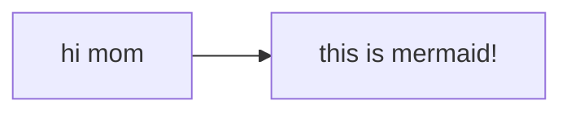

## Play Activator screen need to be reworked

### UI

The play activator screen is too simple, it should have a more complex UI, like rendering the tree
graph. [this](https://github.com/patrykandpatrick/vico?tab=Apache-2.0-1-ov-file#readme) could be
useful

- Add paddings on search screen
- Add paddings on play activator screen

### UX

- Simplify manage tasks screen
  - Remove the "create activator" button
  - move it to the edit task screen
- Maybe approximating it to something like spotify UI would give user a familiar experience
- Main screen should be less monotone and more distinct
    - Design a new page layout
- Implement a settings screen
- Implement a help screen
- Implement a about screen
- Implement a feedback screen
- Implement a tutorial screen
- Implement a statistics screen
- Implement a history screen
    - Implement a calendar view too?
    - This should be on the stats screen as a composable
    - This is a perfect alternative to manage activators screen
- Implement a progress bar on playActivatorScreen
  - This could go against the "don't show the user how much time is left" rule

- Playlists need to be implemented
    - Allow skipping to next subtask
    - As specified by task.isPlaylist
- ~~Allow pausing and resuming~~
    - If you started a task, you must finish it
- Allow doing tasks in the background like in spotify mini player
- Allow setting a task as a favorite
    - This one sounds like a good idea, but it's not necessary
- Allow doing tasks while you're in a waiting task
    - As specified by task.allowParallelTasks and task.waitTime
- Implement TTS on playActivatorScreen
- Warn user when archiving a task that it has active activators if applicable

### Code

- Background-running code should be moved to its viewmodel
    - Prioritize starting with play activator screen
- Remove resources entity?
- Replace all hardcoded strings with resources
