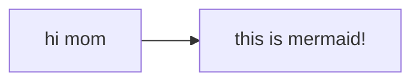

## Play Activator screen need to be reworked

### UI

The play activator screen is too simple, it should have a more complex UI, like rendering the tree
graph. [this](https://github.com/patrykandpatrick/vico?tab=Apache-2.0-1-ov-file#readme) could be
useful

- ActivatorCardRow's cards should display task's icon

### UX

- Maybe approximating it to something like spotify UI would give user a familiar experience
- Main screen should be less monotone and more distinct
    - Design a new page layout
- Implement a settings screen
- Implement a help screen
- Implement a about screen
- Implement a feedback screen
- Implement a tutorial screen
- Implement a statistics screen

- Playlists need to be implemented
    - Allow skipping to next subtask
    - As specified by task.isPlaylist
- ~~Allow pausing and resuming~~
    - If you started a task, you must finish it
- Allow doing tasks in the background like in spotify mini player
- Allow setting a task as a favorite
    - This one sounds like a good idea, but it's not necessary
- Allow doing tasks while you're in a waiting task
    - As specified by task.allowParallelTasks and task.waitTime

### Code

- Background-running code should be moved to its viewmodel
    - Prioritize starting with play activator screen
- remove resources entity?
- Replace all hardcoded strings with resources
