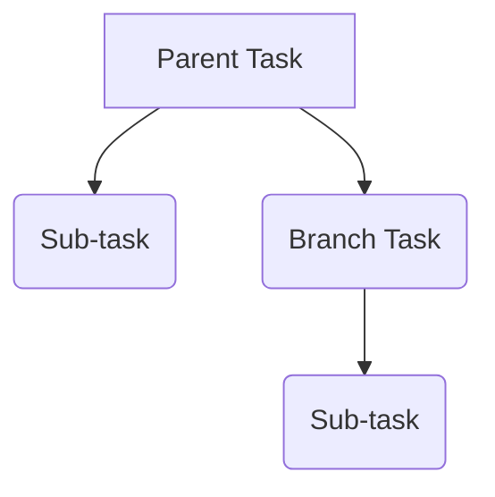

Tasdks is composed of tasks, activators and executions.

<!--more-->

## Tasks

Tasks are the main building block of Tasdks.
They can be as simple as "Buy milk" or as complex as "Write a novel".

If a task is too complex it must be [divided](../creating-tasks/#when-to-divide-a-task-into-subtasks) into [Sub-tasks](#SubTask)

A task can be of up to 4 types:

|                    | Doesn't has parent         | Has parent                 |
|--------------------|----------------------------|----------------------------|
| Doesn't has child  | [Branch task](#BranchTask) | [Sub-task](#SubTask)       |
| Has child          | [Parent task](#ParentTask) | [Orphan task](#OrphanTask) |

Here a diagram for visualizing the relationship between tasks:

It also depends of which task you take as a reference as any sub-task can be a orphan task.

### Parent task {#ParentTask}

Is a task that has one or more sub-tasks.

### SubTask {#SubTask}

Is a task that is part of a parent task.

## Activators

Activators are used to set the schedule of a task.

You can have multiple activators for a task! For example for the task "Go to the bank" you can have an activator that triggers every week and another that triggers every month.

With them you can specify when should it start and when is the deadline.

## Executions

They track the progress of a task, how long it takes to complete it and in which context it was done.

an execution can be started from a task or an activator, making possible to later analyze and predict the time it will take to complete a task.
