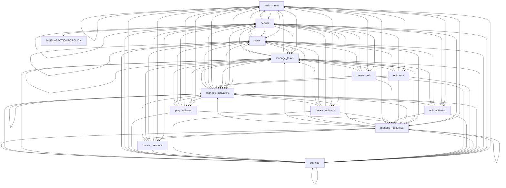

As gephi graph csv:

```
main_menu;main_menu;search;stats;manage_tasks;manage_activators;manage_resources;settings;play_activator
search;main_menu;search;stats;manage_tasks;manage_activators;manage_resources;settings;create_task;create_activator;create_resource;MISSINGACTIONFORCLICK
stats;main_menu;search;stats;manage_tasks;manage_activators;manage_resources;settings
settings;main_menu;search;stats;manage_tasks;manage_activators;manage_resources;settings
manage_tasks;main_menu;search;stats;manage_tasks;manage_activators;manage_resources;settings;create_task;play_activator;edit_task
manage_activators;main_menu;search;stats;manage_tasks;manage_activators;manage_resources;settings;create_activator;play_activator;edit_activator
manage_resources;main_menu;search;stats;manage_tasks;manage_activators;manage_resources;settings;create_resource
edit_task;main_menu;search;stats;manage_tasks;manage_activators;manage_resources;settings
edit_activator;main_menu;search;stats;manage_tasks;manage_activators;manage_resources;settings
create_task;main_menu;search;stats;manage_tasks;manage_activators;manage_resources;settings
create_activator;main_menu;search;stats;manage_tasks;manage_activators;manage_resources;settings
create_resource;main_menu;search;stats;manage_tasks;manage_activators;manage_resources;settings
play_activator;main_menu;search;stats;manage_tasks;manage_activators;manage_resources;settings
```